# System Architecture

## System Architecture Diagram

```mermaid
graph TB
    %% User Layer
    User[👤 End Users]
    
    %% Frontend Layer
    subgraph "Frontend (Vercel)"
        React[React 19 + TypeScript]
        Vite[Vite Build Tool]
        Bootstrap[Reactstrap + Bootstrap]
        Router[React Router DOM]
    end
    
    %% Backend Layer
    subgraph "Backend (Render)"
        SpringBoot[Spring Boot 3.5.3]
        Security[Spring Security + JWT]
        Controllers[Controllers]
        Services[Services]
        Repositories[Repositories]
    end
    
    %% Database Layer
    subgraph "Database (PostgreSQL)"
        DB[(PostgreSQL Database)]
        Tables[Event, Group, User Tables]
    end
    
    %% Messaging Layer
    subgraph "Message Queue (CloudAMQP)"
        RabbitMQ[RabbitMQ]
        RSVPExchange[RSVP Exchange]
        ConfirmedQueue[Confirmed Queue]
        WaitlistQueue[Waitlist Queue]
        CancelledQueue[Cancelled Queue]
    end
    
    %% External Services
    subgraph "External Services"
        Auth0[Auth0 OAuth2]
        ImageService[Image Service]
    end
    
    %% CI/CD Pipeline
    subgraph "CI/CD (GitHub Actions)"
        GitHub[GitHub Repository]
        Actions[GitHub Actions]
        MavenBuild[Maven Build]
        Tests[Unit & Integration Tests]
    end
    
    %% Data Flow
    User --> React
    React --> SpringBoot
    SpringBoot --> DB
    SpringBoot --> RabbitMQ
    RabbitMQ --> RSVPExchange
    RSVPExchange --> ConfirmedQueue
    RSVPExchange --> WaitlistQueue
    RSVPExchange --> CancelledQueue
    
    %% Authentication Flow
    React --> Auth0
    Auth0 --> SpringBoot
    
    %% Build Pipeline
    GitHub --> Actions
    Actions --> MavenBuild
    MavenBuild --> Tests
    MavenBuild --> SpringBoot
    
    %% Styling
    classDef frontend fill:#61dafb,stroke:#333,stroke-width:2px
    classDef backend fill:#6db33f,stroke:#333,stroke-width:2px
    classDef database fill:#336791,stroke:#333,stroke-width:2px
    classDef messaging fill:#ff6600,stroke:#333,stroke-width:2px
    classDef external fill:#f39c12,stroke:#333,stroke-width:2px
    classDef cicd fill:#24292e,stroke:#333,stroke-width:2px
    
    class React,Vite,Bootstrap,Router frontend
    class SpringBoot,Security,Controllers,Services,Repositories backend
    class DB,Tables database
    class RabbitMQ,RSVPExchange,ConfirmedQueue,WaitlistQueue,CancelledQueue messaging
    class Auth0,ImageService external
    class GitHub,Actions,MavenBuild,Tests cicd
```



## Technology Stack

### Frontend
- **Framework**: React 19 with TypeScript
- **Build Tool**: Vite 6.3.5
- **UI Library**: Reactstrap 9.2.3 + Bootstrap 5.3.7
- **Routing**: React Router DOM 7.6.2
- **State Management**: React Hooks (useState, useEffect, useCallback, useMemo)
- **Deployment**: Vercel

### Backend
- **Framework**: Spring Boot 3.5.3
- **Language**: Java 17
- **Build Tool**: Maven
- **Security**: Spring Security + JWT + OAuth2 (Auth0)
- **Database Access**: Spring Data JPA
- **Deployment**: Render

### Database
- **Primary**: PostgreSQL (migrated from H2)
- **ORM**: JPA/Hibernate
- **Entities**: Event, Group, User

### Message Queue
- **Service**: RabbitMQ via CloudAMQP
- **Configuration**: Spring AMQP
- **Queues**: 
  - RSVP Confirmed Queue
  - Waitlist Queue
  - RSVP Cancelled Queue
- **Exchange**: Topic-based RSVP Exchange

### Authentication & Authorization
- **Provider**: Auth0 OAuth2
- **Token Type**: JWT
- **Storage**: localStorage
- **Security**: CORS, CSRF protection

### CI/CD Pipeline
- **Platform**: GitHub Actions
- **Triggers**: Push to main/stable-base, Pull Requests
- **Build**: Maven with Java 17 (Temurin)
- **Testing**: Unit and Integration tests
- **Environment**: Ubuntu Latest

## System Components

### Frontend Components
- **App.tsx**: Main application component
- **AppNavbar.tsx**: Navigation with authentication
- **EventList.tsx**: Display and manage events
- **GroupCards.tsx**: Group management interface
- **EventCalendar.tsx**: Calendar view for events
- **EventEdit.tsx**: Event creation/editing
- **GroupEdit.tsx**: Group creation/editing

### Backend Controllers
- **AuthController**: Authentication endpoints
- **EventController**: Event CRUD operations
- **GroupController**: Group management
- **UserController**: User operations
- **HomeController**: Dashboard data

### Services
- **JwtService**: JWT token management
- **ImageService**: Image URL generation
- **RsvpMessageProducer**: RSVP message publishing

### Messaging System
- **RsvpMessage**: Message model for RSVP events
- **RsvpMessageProducer**: Publishes RSVP messages
- **RsvpMessageConsumer**: Processes RSVP messages
- **RabbitConfig**: Queue and exchange configuration

## Data Flow

1. **User Authentication**: Frontend authenticates via Auth0, receives JWT
2. **API Requests**: Frontend sends authenticated requests to Spring Boot backend
3. **Data Operations**: Backend processes requests through service layer to database
4. **RSVP Processing**: Event RSVPs trigger message publishing to RabbitMQ
5. **Message Consumption**: Background consumers process RSVP messages
6. **Real-time Updates**: Frontend receives updated data and re-renders

## Security Features

- JWT-based authentication
- OAuth2 integration with Auth0
- CORS configuration for cross-origin requests
- CSRF protection
- Input validation and sanitization
- Secure cookie handling

## Performance Optimizations

- React component memoization
- Infinite scrolling for large datasets
- Pagination for database queries
- Message queue for asynchronous processing
- CDN deployment for frontend assets

## Deployment Architecture

```
┌─────────────────┐    ┌─────────────────┐    ┌─────────────────┐
│   Frontend      │    │    Backend      │    │   Database      │
│   (Vercel)      │◄──►│   (Render)      │◄──►│  (PostgreSQL)   │
│                 │    │                 │    │                 │
│ • React App     │    │ • Spring Boot   │    │ • Event Data    │
│ • Static Assets │    │ • JWT Auth      │    │ • Group Data    │
│ • CDN           │    │ • REST APIs     │    │ • User Data     │
└─────────────────┘    └─────────────────┘    └─────────────────┘
         │                       │                       │
         │                       │                       │
         ▼                       ▼                       ▼
┌─────────────────┐    ┌─────────────────┐    ┌─────────────────┐
│   Auth0         │    │   RabbitMQ      │    │   GitHub        │
│   OAuth2        │    │   (CloudAMQP)   │    │   Actions       │
│                 │    │                 │    │                 │
│ • Authentication│    │ • RSVP Queue    │    │ • CI/CD         │
│ • JWT Tokens    │    │ • Message Bus   │    │ • Auto Deploy   │
│ • User Profile  │    │ • Async Proc    │    │ • Testing       │
└─────────────────┘    └─────────────────┘    └─────────────────┘
```

## Development Workflow

1. **Code Changes**: Developers push to GitHub
2. **Automated Testing**: GitHub Actions run Maven build and tests
3. **Deployment**: Successful builds trigger deployment to Render
4. **Frontend Build**: Vercel automatically builds and deploys React app
5. **Database Migrations**: Backend handles schema updates
6. **Message Queue**: RabbitMQ ensures reliable RSVP processing

## Scalability Considerations

- **Horizontal Scaling**: Render supports multiple backend instances
- **Database**: PostgreSQL can be scaled with read replicas
- **Message Queue**: RabbitMQ handles high-volume RSVP processing
- **CDN**: Vercel provides global content distribution
- **Caching**: React state management reduces unnecessary API calls

## Monitoring & Observability

- **Logging**: SLF4J with structured logging
- **Performance**: Response time tracking in controllers
- **Error Handling**: Graceful error responses with user-friendly messages
- **Health Checks**: Spring Boot actuator endpoints
- **Queue Monitoring**: RabbitMQ management interface
