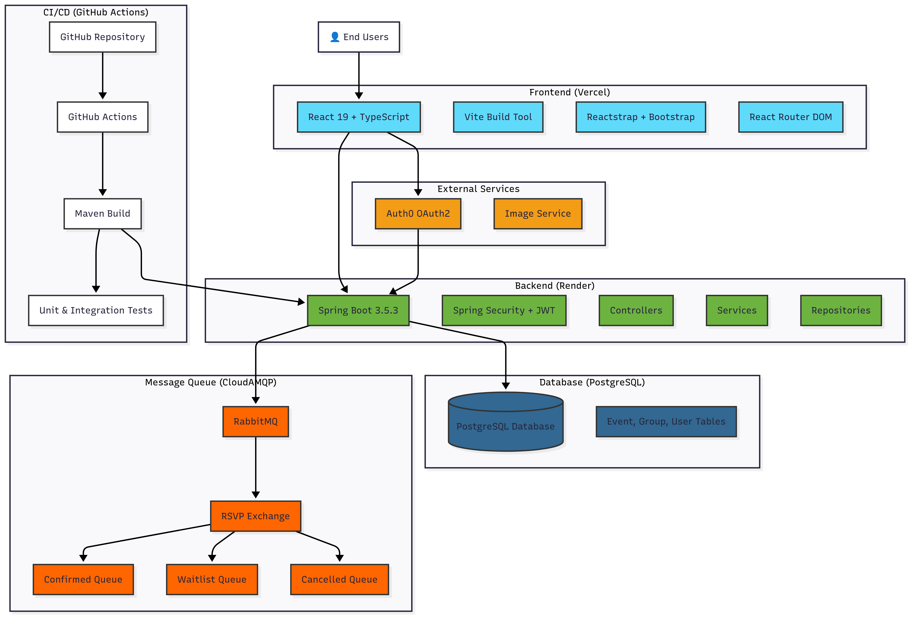

# Minmeetup

A full-stack web application for managing social events and tours. Users can discover groups, join them, and manage events.

## System Architecture


## Features

### Authentication & Security

- OAuth2 authentication via Auth0
- Secure session management
- Protected API endpoints
- Automatic login/logout handling

### Group Management

- Browse available JUG groups
- Join existing groups to your tour
- Leave groups without deleting them
- View group details and location information

### Event Management

- Create and manage events for your groups
- Event details with dates, descriptions, and locations
- Filter events by group

### Modern UI

- Responsive React frontend with Bootstrap
- TypeScript for type safety
- Modern component architecture
- Mobile-friendly design

## Tech Stack

### Backend

- **Spring Boot 3.5.3** - Java framework
- **Spring Security** - Authentication and authorization
- **Spring Data JPA** - Database operations
- **PostgreSQL** - Production database
- **H2 Database** - Development and testing database
- **Lombok** - Boilerplate code reduction
- **Maven** - Build tool

### Frontend

- **React 19** - UI framework
- **TypeScript** - Type safety
- **Vite** - Build tool and dev server
- **Bootstrap 5** - CSS framework
- **Reactstrap** - Bootstrap components for React
- **React Router** - Client-side routing
- **React Cookie** - Cookie management

### Authentication

- **Auth0** - OAuth2 provider
- **Spring Security OAuth2** - OAuth2 client integration

## API Endpoints

### Authentication Required

All endpoints require OAuth2 authentication via Auth0.

### User Management

- `GET /api/user` - Get current user information
- `POST /api/logout` - Logout user and invalidate session

### Groups

- `GET /api/groups` - Get all groups belonging to the authenticated user
- `GET /api/groups/available` - Get all available JUG groups (public)
- `GET /api/groups/{id}` - Get specific group by ID
- `POST /api/groups` - Create a new group or join existing group
- `PUT /api/groups/{id}` - Update group information
- `DELETE /api/groups/{id}` - Delete a group
- `DELETE /api/groups/members/{id}` - Leave a group (remove user association)

### Events

- `GET /api/events` - Get all events belonging to the authenticated user (with group details)
- `GET /api/events/available` - Get all available events (public)
- `GET /api/events/{id}` - Get specific event by ID
- `POST /api/events` - Create a new event
- `PUT /api/events/{id}` - Update event information
- `DELETE /api/events/{id}` - Delete an event

## Data Models

### Group

- `id` - Unique identifier
- `name` - Group name
- `address` - Street address
- `city` - City
- `stateOrProvince` - State or province
- `country` - Country
- `postalCode` - Postal code
- `user` - Associated user (nullable)

### Event

- `id` - Unique identifier
- `title` - Event title
- `description` - Event description
- `date` - Event date and time
- `group` - Associated group

### User

- `id` - Auth0 user ID
- `name` - User's display name
- `email` - User's email address

## Getting Started

### Prerequisites

- Java 17 or higher
- Node.js 18.16.0 or higher
- Maven 3.6 or higher

### Backend Setup

1. Clone the repository
2. Configure Auth0 OAuth2 credentials in `src/main/resources/application.properties`
3. Run the Spring Boot application:
   ```bash
   mvn spring-boot:run
   ```
4. Backend will be available at `http://localhost:8080`

### Frontend Setup

1. Navigate to the frontend directory:
   ```bash
   cd my-app
   ```
2. Install dependencies:
   ```bash
   npm install
   ```
3. Start the development server:
   ```bash
   npm run dev
   ```
4. Frontend will be available at `http://localhost:5173`

### Production Build

To build for production:

```bash
mvn clean package -Pprod
```

## Security Configuration

The application uses Spring Security with OAuth2 authentication:

- All API endpoints require authentication
- CSRF protection is enabled
- Session management is configured
- OAuth2 client is configured for Auth0

## Database

The application supports multiple database configurations:

### Local Development (Default)

- **H2 Database**: In-memory database for quick local development
- Database is automatically created on startup
- Sample data is loaded via `Initializer.java`
- Data persists for the duration of the application session

### Docker Development Environment

- **PostgreSQL**: For production-like development environment
- Uses Docker Compose with separate containers for PostgreSQL and backend

### Production Environment

- **PostgreSQL**: Production database with persistent storage

### Database Setup

#### Option 1: H2 (Default Local Development)

Simply run the application:

```bash
mvn spring-boot:run
```

#### Option 2: Docker with PostgreSQL (Recommended for Development)

1. **Start both PostgreSQL and Backend**:

   ```bash
   docker-compose up -d
   ```

2. **Or start just PostgreSQL**:
   ```bash
   docker-compose up -d postgres
   ```
   Then run your backend locally with:
   ```bash
   mvn spring-boot:run -Dspring.profiles.active=dev
   ```

#### Option 3: Manual PostgreSQL Setup

1. Install PostgreSQL 15 or higher
2. Create a database: `createdb jugtours_dev`
3. Set environment variables:
   ```bash
   export DATABASE_URL=...
   export DATABASE_USERNAME=...
   export DATABASE_PASSWORD=...
   ```
4. Run with dev profile:
   ```bash
   mvn spring-boot:run -Dspring.profiles.active=dev
   ```

### Environment Variables for PostgreSQL

| Variable            | Description               |
| ------------------- | ------------------------- |
| `DATABASE_URL`      | PostgreSQL connection URL |
| `DATABASE_USERNAME` | Database username         |
| `DATABASE_PASSWORD` | Database password         |
| `DATABASE_DRIVER`   | JDBC driver class         |

## Contributing

1. Fork the repository
2. Create a feature branch
3. Make your changes
4. Test thoroughly
5. Submit a pull request

## License

This project is licensed under the MIT License.
